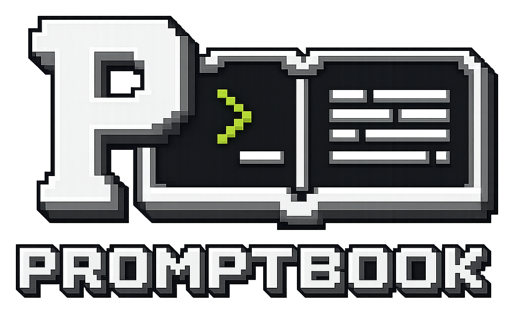

<p align="center"></p>

# promptbook

**Storybook for prompts.** Compose system prompts from reusable fragments by
declarative rules, *see* every assembled variant, and let agents test and edit
them in a deterministic loop. Model-, provider-, language- and platform-agnostic.

Prompts start as throwaway text, then get reused across flows, grow conditional
logic, and return structured data — they become production code but are still
written like sticky notes. promptbook treats them as code: which fragments are
shared, what is safe to change, and what the final prompt looks like under a
given context are all answerable without running a single model call.

## Quickstart

Three ways to use promptbook. Pick one.

**For your agent.** One command installs the skills your agent uses to read,
edit and migrate prompts — works with Claude Code, Cursor, Codex, Copilot,
Gemini and 15+ other agents:

```bash
npx skills add markbrutx/promptbook
```

Ships four skills: `promptbook-install`, `promptbook-migrate`,
`promptbook-doctor`, `promptbook-annotations`. Browse them on
[skills.sh](https://skills.sh/markbrutx/promptbook).

**For the CLI.** Point it at a prompts folder and assemble a prompt — runs
without installation:

```bash
npx @markbrutx/promptbook-cli view --dir examples/support-assistant
```

Verbs: `ls` · `resolve` · `view` · `lint` · `eval`. Full surface in [CLI](#cli).

**For the library.** Import `resolve()` in any Node or edge runtime:

```bash
npm i @markbrutx/promptbook-core
```

```ts
import { resolve } from "@markbrutx/promptbook-core";

const { text, trace } = await resolve({
  promptsDir: "./examples/support-assistant",
  prompt: "reply",
  context: { model: "claude", locale: "English" },
});
```

`text` is the assembled prompt — fragments joined with `\n\n`, in final order,
with `${...}` substituted. `trace` is the explain output: every rule (fired +
why), the final id order, what was replaced / added / forbidden, context axes
no rule matched, and warnings. A missing `${var}` renders empty and is
recorded in `trace.warnings` — the engine never throws on data.

## The model: WHAT / WHEN / HOW

- **WHAT — `fragment`** — a reusable micro-prompt: a Markdown file with YAML
  frontmatter and a body that may contain `${path}` placeholders.
- **WHEN — `rule`** — declarative `when <context> → add / replace / forbid /
  order <fragment>`, expressed as *data*, not code.
- **HOW — `resolve()`** — a pure function returning the assembled string; a thin
  adapter sends it to a model.

Think of it as CSS for prompts: fragments are declarations, rules are selectors,
the resolver is the cascade. Assembly is deterministic (same folder + context →
byte-identical string); the only stochastic step, the model call, lives behind
an adapter.

A prompts folder looks like:

```
prompts/
├─ fragments/     *.md     (text + frontmatter)              — WHAT
├─ rules/         *.yaml    (one composition per file)       — WHEN
├─ code-prompts/  *.yaml    (builder metadata + samples)     — computed prompts in the menu
└─ fixtures/      *.json    (eval cases / named variants)
```

A book indexes **every** prompt of a domain as one menu. A node is either a
**composition** (declarative, assembled by `resolve`) or a **code-prompt** — a
builder that stays in code, where the book holds only its metadata and frozen
output samples and the core never executes it. Declarative prompts compose;
genuinely computed ones still register and show up in `ls` and the viewer with a
`code` badge, so the menu is complete and honest.

## Multi-model compilation

The target model is just another context axis, and the output format a model
wants is just a rule — so one logical prompt compiles to a different contract per
model, from a single shared definition:

```yaml
- when: { model: gpt }
  replace: { reply-format-prose: reply-format-json }   # JSON object contract
- when: { model: claude }
  replace: { reply-format-prose: reply-format-xml }    # XML-tagged output
```

Incumbents store a flat string per model. Here the model and its format are one
axis over one prompt. See it end to end in
[`examples/support-assistant`](examples/support-assistant).

## CLI

```
promptbook resolve <prompt>   Assemble a prompt and print it to stdout (--all: every book)
promptbook ls                 List compositions, code-prompts and fragments (--all: cross-book)
promptbook lint [<prompt>]    Static checks (no model): dead/unused/dangling, budget, banned tokens
promptbook eval [<name>]      Run fixtures through a model adapter, report pass-rate
promptbook bundle [<dir>]     Compile a folder into an importable book module (--all/--check)
promptbook watch [<dir>]      Rebuild book.generated.ts on every fragment/rule edit
promptbook view               Start the local web viewer over the folder
promptbook annotations <a>    Drain the viewer's feedback queue: list | resolve <id> | clear
```

`promptbook watch` is the dev loop: it rebundles each book's
`book.generated.ts` as soon as a fragment / rule / code-prompt /
`promptbook.json` changes. `promptbook bundle --check --all` is the CI gate:
it exits 1 when any checked-in `book.generated.ts` has drifted from the source
folder, so the bundled artifact cannot fall out of sync silently. Pair either
with `--exclude-code-prompts` to keep `code-prompts/` on disk as metadata
while shipping a runtime-lean bundle.

`--dir` picks the folder (else `promptbook.json` `promptsDir`, else `./prompts`);
`--ctx key=value` sets context; `--json` emits machine-readable output. stdout is
the payload, stderr is explanations and warnings, and `NO_COLOR` is honored.

## Workspaces

A folder can be one book (`fragments/` + `rules/`) or a **workspace** of sibling
books. The CLI and viewer discover the books under a root and address them
without juggling one `--dir` at a time:

```bash
promptbook ls --all --json           # cross-book inventory: each book's
                                     # compositions, code-prompts + required context
promptbook resolve <book>/<comp>     # address a composition in a named book
promptbook resolve <comp>            # bare name resolves by uniqueness across books
promptbook resolve --all             # assemble every composition of every book
promptbook view                      # one viewer with a book switcher in the sidebar
```

Each composition declares the context it needs — the `${var}` keys across its
reachable fragments and the `when:`-axes its rules branch on — so you can supply
defaults instead of chasing `Missing variable` warnings one at a time. A
single-book `--dir` keeps working unqualified (back-compat).

## Viewer

`promptbook view` opens a local web app over the folder: a sidebar tree of
compositions, variants and fragments; the assembled prompt with colored segments
by source fragment; context pickers that re-assemble live; a used-in graph
(which prompts share a fragment); variant diff; and inline lint + explain. Select
text, attach a comment, and it lands in a file queue an agent drains via
`promptbook annotations`.

## Packages

| Package | What it is |
|---------|------------|
| [`@markbrutx/promptbook-core`](packages/core) | The library. `resolve()`, `lint()`, `eval()`, bundle. Pure functions, zero CLI/UI deps. Ships a zero-dep `./edge` build for edge runtimes. |
| [`@markbrutx/promptbook-cli`](packages/cli) | `promptbook resolve \| ls \| lint \| eval \| bundle \| watch \| view \| annotations`. The surface for agents and CI. |
| [`@markbrutx/promptbook-viewer`](packages/viewer) | `promptbook view` → a local web app. Sidebar tree, colored segments, context pickers, used-in graph, diff, annotate-to-agent. |
| [`@markbrutx/promptbook-openrouter`](packages/openrouter) | OpenRouter `ModelAdapter` for `eval`. Network lives here; core stays pure. |

## Develop

npm workspaces, Node ≥ 20.6, TypeScript (NodeNext, strict), tsgo, vitest, biome.

```
npm run build       # tsgo per package (+ edge bundle, + viewer web)
npm run typecheck
npm run test
npm run check       # biome + knip
```

See [CONTRIBUTING.md](CONTRIBUTING.md) for the two invariants that keep this
toolkit small and agnostic.

## License

[MIT](LICENSE)
